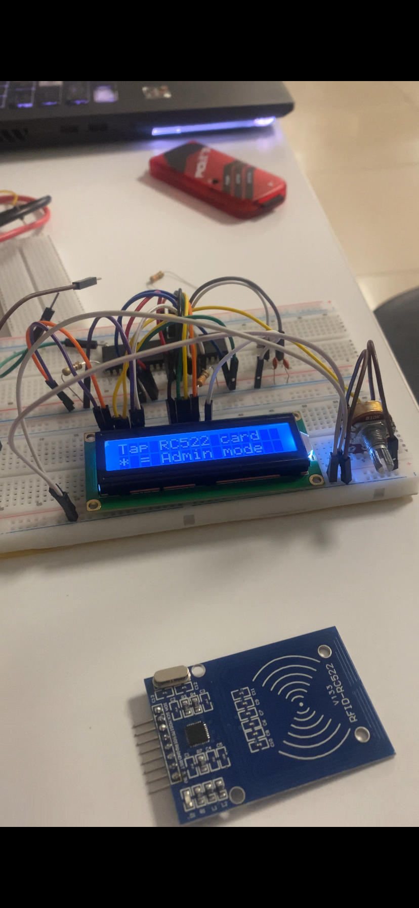

# Digital Attendance System with RFID

## Project Overview

A digital attendance system built on the PIC16F877A microcontroller.

Students mark attendance by tapping an RFID card on the RC522 reader.

The system validates the card, marks attendance in internal EEPROM,

gives feedback via LCD, LEDs and buzzer, and logs all events to a PC

via serial UART.

## Project Photo

## Three Interfaces

- Interface 1: RFID input via RC522 module (SPI protocol)

- Interface 2: LCD + Green/Red LEDs + Buzzer (feedback)

- Interface 3: Serial logging to PC via USB-TTL UART at 9600 baud

## Hardware

- PIC16F877A microcontroller at 4MHz

- RC522 RFID reader module

- 16x2 LCD display in 4-bit mode

- 4x4 membrane keypad (admin only)

- Active buzzer

- Green and Red LEDs

- USB-TTL CH340 adapter

- Lab power supply at 5V

## Features

- Student enrollment via admin mode

- Duplicate card detection

- Unknown card rejection

- Admin mode with PIN protection

- Attendance count display

- Session reset

- Real time serial log to PC via PuTTY

## Admin Mode

- Press * on keypad

- Enter PIN: 0000

- Options: 1=Count, 2=Reset, 3=Enroll, 4=Clear, #=Exit

## Group Members

- Shayan Kargar

- Raya Ghazizadeh

- Helya Ghazizadeh

## Course

Microprocessors 2026
